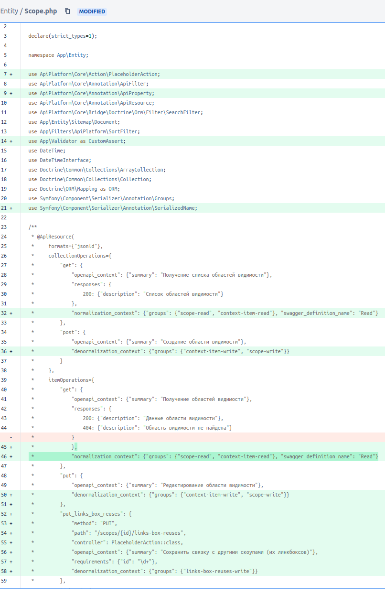

# api-platform-understanding

Цель проекта:
* разобраться в ApiPlatform с помощью тестов
* запускать данные тесты в своем CI для гарантии, что в обновленной версии ApiPlatform не поломали базовый функционал

Как изучать:
* смотреть примеры запросов и ответов в тестах
* читать пояснения в тестах (особенно по слову "НЕОЖИДАННО")
* читать дальше данный README.md
* изучать официальную документацию https://api-platform.com/docs/core/serialization/
* изучать неофициальную https://symfonycasts.com/screencast/api-platform/collections-create
* изучать неофициальную https://symfonycasts.com/screencast/api-platform/embedded-write
* о фильтрации и сортировке https://yapro.ru/article/6044

Важные моменты:
* если запустить тесты, то можно увидеть, что тесты пройдены, но печатаются какие-то ошибки, это следствие того, что 
  используется Symfony KernelBrowser, подробности в OneItemTest::testDeleteNonExistentBook()
* нельзя доверять валидацию объектов симфони-валидатору, т.к. он не применяется если объекты наполняются внутри приложения

Работа с коллекциями:
* чтобы работал метод PUT и PATCH для свойства, которое является коллекцией сущностей, в сущность должны быть 
  добавлены 2 метода: addPropertyName и removePropertyName (PropertyName это имя свойства класса сущности).
* чтобы работала очистка, через PUT и PATCH в аннотации к свойству нужно добавить orphanRemoval=true.


## Настройки

Следующая настройка заставляет \ApiPlatform\Core\Bridge\Doctrine\Orm\Extension\EagerLoadingExtension использовать 
sql-join'ы для получения данных всех связанных сущностей, при этом вложенность никак ограничить нельзя (все что связано, 
все будет вытащено из бд).
```yaml
api_platform.eager_loading = true
```
Уменьшить вложенность данных в ответе можно только с помощью аннотаций групп симфони-сериализатора. У себя в проекте мы 
решили не указывать группу нормализации (apiRead) для свойств-отношений (свойств коллекций в сущности) которые имеют 
очень большую вложенность, т.е. было:
```injectablephp
/**
* @Groups({"apiRead", "apiWrite"})
*/
private Collection $products;
```
Стало:
```injectablephp
/**
* @Groups({"apiWrite"})
*/
private Collection $products;
```
Т.е. отношения запрашивать будем из самой коллекции, например: "/api/products" c фильтром по свойству bundle.

### MaxDepth

Если все-таки потребуется получать сразу коллекцию, то укажем отдельную группу "Company:apiRead" для свойства $products, 
на необходимую глубину отношений с помощью Symfony\Component\Serializer\Annotation\MaxDepth + enable_max_depth:
```injectablephp
/**
 * @ApiPlatform(normalizationContext={"groups"={"read"}, "enable_max_depth"=true})
 */
class Book {
    /**
     * @ORM\ManyToOne(targetEntity="User", inversedBy="books")
     * @Groups({"read"})
     * @MaxDepth(1)
     */
    private $author;
}
```
Еще есть интересная аннотация: @ApiSubresource(maxDepth=1)

### skip_null_values (default: true)

А если указать "skip_null_values": false в:
- denormalizationContext - то в реквесте все свойства объекта должны быть указаны, даже nullable
- normalizationContext - то в респонсе все свойства объекта будут присутствовать, даже со значением null

Где указывается:
```php
 * @ApiResource(
 *     normalizationContext={
 *         "groups": {"apiRead"},
 *         "skip_null_values": false
 *     },
 *     denormalizationContext={
 *         "groups": {"apiWrite"},
 *         "skip_null_values": false
 *     }
 * )
```

Запретить доступ к чтению и записи в поле, но дать доступ на чтение IRI можно так:
```injectablephp
use ApiPlatform\Core\Annotation\ApiProperty;
 /**
 * @Groups({"apiRead", "apiWrite"})
 * @ApiProperty(readableLink=false, writableLink=false)
 */
private Book $parent;
```
Таким образом можно ограничить рекурсию - например ссылка на другую сущность или на запись родителя.

Разрешить искать и сортировать записи можно так:
```injectablephp
@ApiFilter(SearchFilter::class, strategy="ipartial")
@ApiFilter(OrderFilter::class, properties={"id", "author", "publicationDate"})
```

Интересные аннотации:
```injectablephp
@ApiProperty(attributes={"fetchEager": false, "fetchable": false})
@SerializedName("public_field_name")
```

### Автоматические группы apiRead/apiWrite

Следующий пример демонстрирует, как можно автоматически (при необходимости динамично) выставлять группы apiRead/apiWrite
всем (или некоторым) атрибутам сущностей:

```yaml
    YaPro\ApiPlatformUnderstanding\Wrapper\ClassMetadataFactoryWrapper:
        # overrides the "decorates" service, but that service is still available as ".inner"
        decorates: 'api_platform.serializer.mapping.class_metadata_factory'
        arguments: [ '@.inner' ]
        decoration_priority: -20
    # чтобы ApiPlatform не кэшировал значение возвращаемое методом ClassMetadataFactoryWrapper::getMetadataFor заменяем:
    'api_platform.cache.metadata.property':
      class: Symfony\Component\Cache\Adapter\ArrayAdapter
```
См. [src/Wrapper/ClassMetadataFactoryWrapper.php](src/Wrapper/ClassMetadataFactoryWrapper.php)

### Дополнительные группы сериализации

Это можно сделать, создав для сущности дополнительный эндпоинт (не обязательно писать свой, можно через аннотации):
```injectablephp
 *         "put_links_box_reuses": {
 *             "method": "PUT",
 *             "path": "/book/{id}/reviews",
 *             "controller": PlaceholderAction::class,
 *             "openapi_context": {"summary": "UPSERT коллекции для указанной сущности"},
 *             "requirements": {"id": "\d+"},
 *             "denormalization_context": {"groups": {"reviews-write"}}
 *         },
```
Именно так делать не нужно, потому что ApiPlatform из коробки дает возможность делать такой Upsert, но как пример эта
ситуация очень хороша, кстати вот полный пример:



## Как запустить тесты или поправить их

Предисловие: в репозитории имеется файл composer.lock.dist, необходимый, чтобы понимать, когда и при каких версиях
зависимостей текущие тесты успешно проходят, но Вы можете запускать их на основании своего composer.lock файла, это
позволит выявлять расхождения в версиях библиотеки ApiPlatform.

### Build

```sh
docker build -t yapro/api-platform-understanding:latest -f ./Dockerfile ./
```

### Tests

```sh
docker run --rm --user=1000:1000 -v $(pwd):/app yapro/api-platform-understanding:latest bash -c "cd /app && \
  bin/console doctrine:schema:drop --full-database --force -v && \
  bin/console doctrine:schema:update --force -v && \
  bin/phpunit tests/Functional"
```
Если тесты падают, попробуйте выполнить: ln -sf composer.lock.dist composer.lock

### Запуск bin/diff-openapi.sh чтобы найти изменения в OAS-контракте

```sh
docker run --rm --user=1000:1000 -v $(pwd):/app yapro/api-platform-understanding:latest bash -c "cd /app && \
  COMPOSER_MEMORY_LIMIT=-1 composer install --optimize-autoloader --no-scripts --no-interaction && \
  bin/console doctrine:schema:drop --full-database --force -v && \
  bin/console doctrine:schema:update --force -v && \
  bin/diff-openapi.sh"
```
Текущая схема находится по адресу public/oas/api-platform.yaml и её можно открыть в редакторе https://editor.swagger.io/

Перегенерировать схему можно так:
```shell
docker run --rm --user=1000:1000 -v $(pwd):/app yapro/api-platform-understanding:latest bash -c "cd /app && \
  COMPOSER_MEMORY_LIMIT=-1 composer install --optimize-autoloader --no-scripts --no-interaction && \
  bin/console doctrine:schema:drop --full-database --force -v && \
  bin/console doctrine:schema:update --force -v && \
  bin/console api:openapi:export --yaml --env=test --output=public/oas/api-platform.yaml"
```

### Dev

А еще можно выполнить команду ниже и смотреть по адресу: http://127.0.0.1:8000/api

```sh
docker run -it --rm --user=$(id -u):$(id -g) --net=host -v $(pwd):/app -w /app yapro/api-platform-understanding:latest bash
COMPOSER_MEMORY_LIMIT=-1 composer install -o && \
bin/console doctrine:schema:drop --full-database --force -v && \
bin/console doctrine:schema:update --force -v && \
php -S 127.0.0.1:8000 -t public
```
Можно заходить по адресу: http://127.0.0.1:8000/api

### Debug PHP:

В phpunit.xml.dist поменяйте APP_ENV на test и запустите:
```sh
docker run --rm --user=$(id -u):$(id -g) -v $(pwd):/app --add-host=host.docker.internal:host-gateway yapro/api-platform-understanding:latest bash -c "cd /app && \
  COMPOSER_MEMORY_LIMIT=-1 composer install --optimize-autoloader --no-scripts --no-interaction && \
  bin/console doctrine:schema:drop --full-database --force -v && \
  bin/console doctrine:schema:update --force -v && \
  PHP_IDE_CONFIG=\"serverName=common\" \
  XDEBUG_SESSION=common \
  XDEBUG_MODE=debug \
  XDEBUG_CONFIG=\"max_nesting_level=200 client_port=9003 client_host=host.docker.internal\" \
  bin/phpunit --cache-result-file=/tmp/phpunit.cache tests/Functional"
```
Если с xdebug что-то не получается, напишите: php -dxdebug.log='/tmp/xdebug.log' и смотрите в лог.

- https://xdebug.org/docs/upgrade_guide
- https://www.jetbrains.com/help/phpstorm/2021.1/debugging-a-php-cli-script.html

Cs-Fixer: fix code
```sh
docker run --user=1000:1000 --rm -v $(pwd):/app -w /app yapro/api-platform-understanding:latest ./php-cs-fixer.phar fix --config=.php-cs-fixer.dist.php -v --using-cache=no --allow-risky=yes
```

PhpMd: update rules
```shell
docker run --user=1000:1000 --rm -v $(pwd):/app -w /app yapro/api-platform-understanding:latest ./phpmd.phar . text phpmd.xml --exclude .github/workflows,vendor,var,public/bundles --strict --generate-baseline
```
